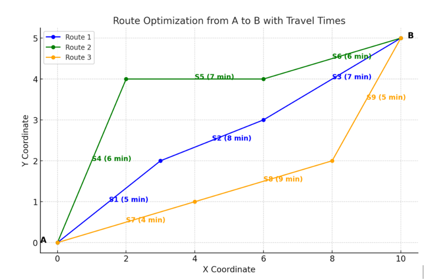
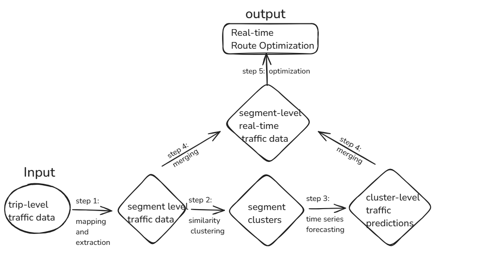
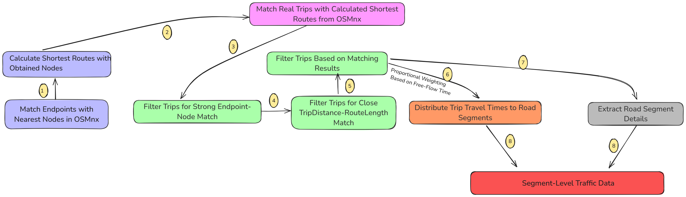
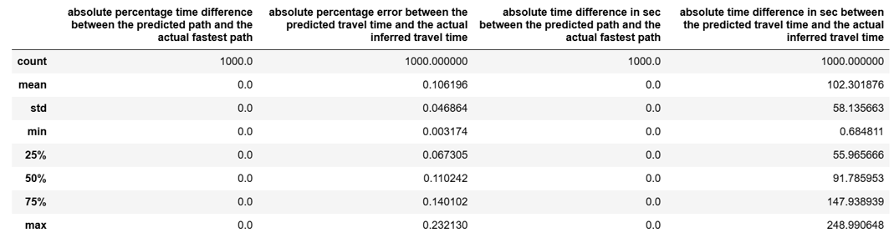
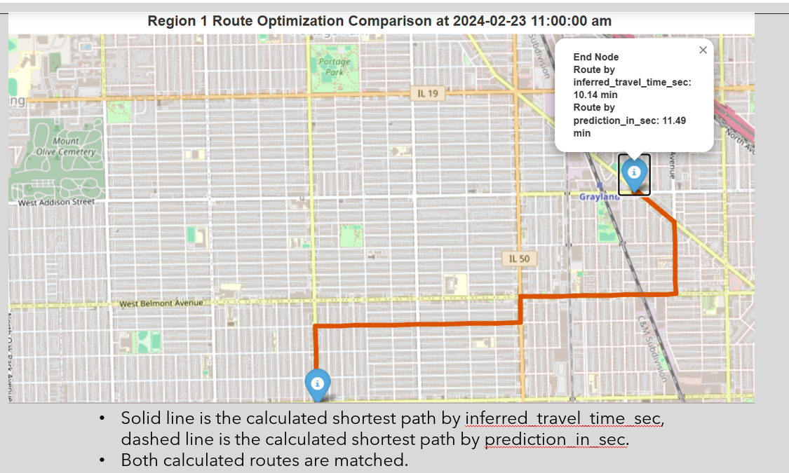

# Route Optimization Model for Fleet Management

Efficient route optimization is critical for applications like fleet management and logistics, where reducing travel time and fuel consumption can significantly improve operational efficiency. However, leveraging real-time traffic data is challenging due to its complexity and lack of availability at the segment level. This project proposes solutions to bridge this gap.

---

## Technologies
- **Python**
- **Scikit-learn**: Machine learning library for clustering.
- **Prophet**: Time-series forecasting for traffic data patterns.
- **XGBoost**: Gradient boosting for travel time prediction.
- **OSMnx**: Graph-based geographic analysis.
- **NetworkX**: Graph manipulation and shortest-path algorithms.

---

## Problem Description

In route optimization, the challenge lies in using traffic data to calculate the optimal route between two nodes. For example, as shown below, given a pair of nodes **A** and **B**, three available routes exist (blue, yellow, and green), each consisting of several road segments (S1 to S9). If real-time traffic information (e.g., travel time) is available for each segment, the shortest route in terms of total travel time can be computed efficiently, which is the yellow route here.

However, **traffic data is often available at the trip level**, containing information such as:
- Total trip distance
- Trip duration
- Start and end timestamps

This makes segment-level optimization challenging. To address this, I proposed a two-step solution:
1. **Convert trip-level traffic data to segment-level traffic information**: By mapping trip data to individual road segments, I enabled segment-level travel time prediction and route optimization.
2. **Cluster road segments with similar properties**: Using KMeans, road segments were grouped based on geographical proximity, traffic patterns and scales. This reduced the complexity of predicting travel time at the individual segment level and addressed issues with incomplete data.

---

## Methodology

---

## Contributions

The main contributions of this work are:
1. **Trip-to-Segment Conversion**:
   - Matched real trips from the original dataset with calculated shortest routes from OSMnx.
   - Filtered trips based on the matching results.
   - Distributed trip travel times to road segments using proportional weighting based on the free-flow travel time of each segment.
   - Extracted road segment details from the OSMnx graph.
   - Converted trip-level traffic data to segment-level traffic data.
   
2. **Cluster-Level Prediction**:
   - Clustered similar road segments.
   - Performed cluster-level travel time predictions.
   - Merged cluster-level prediction results into the segment-level traffic data for real-time route optimization.

---

## Results

### Comparing Route Optimization with Predicted and Inferred Segment-Level Travel Times
To evaluate the performance of the model, the following experiment was conducted:
- **Timestamp Selected**: 2024-03-04 08:00:00.
- **Test Data**: 
  - 1000 pairs of nodes were randomly generated.
  - Each trip had a mean duration of approximately 15 minutes.
  - Each pair had multiple route options to select from.

#### Key Metrics for Comparison:
1. **Absolute percentage time difference between the predicted path and the actual fastest path**:
   abs(predicted fastest path travel time-actual fastest path travel time)/actual fastest path travel time

   **Note: the actual fastest path was calculated based on the inferred segment-level travel time.** 
3. **Absolute percentage error between the predicted travel time and the actual inferred travel time**:
   abs(predicted travel time-inferred travel time)/inferred travel time
4. **Absolute time difference in second between the predicted path and the actual fastest path**:
   abs(predicted fastest path travel time-actual fastest path travel time)

5. **Absolute time difference in second between the predicted travel time and the actual inferred travel time**:
   abs(predicted travel time –actual inferred travel time)

---

#### Visualizing Route Optimization
The following map demonstrates the optimization process for a selected pair of nodes:
- **Nodes Displayed**: Start node and end node.
- **Routes Visualized**: Predicted fastest route calculated by the predicted segment-level travel time and the actual fastest route calculated by the inferred segment-level travel time.

---

## Conclusion

This project demonstrates how trip-level traffic data can be converted to segment-level data to enable real-time route optimization. By clustering road segments and performing cluster-level predictions, the approach balances scalability and accuracy. 

### Key Findings:
- The model achieved **100% accuracy** in recommending the fastest route for the 1000 test cases.
- The **average error** in predicting trip duration was approximately **10%**.

### Limitations and Future Work:
#### Limitations:
1. No real-time traffic data was considered.
2. Segment-level traffic data was indirectly extracted by inferring from trip-level traffic data.
#### Future Work:
1. Incorporate dynamic, real-time traffic data feeds for enhanced accuracy.
2. Extract segment-level traffic data directly by integrating the OSMnx graph with the existing traffic data sources through a precise geospatial alignment. 

---

